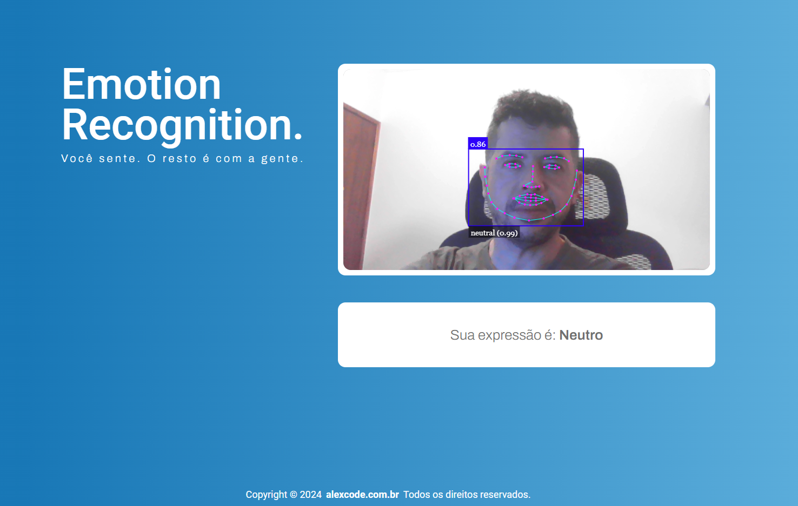
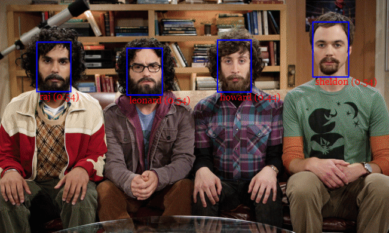

## 🧑🏻‍💻 Reconhecimento facial com React e FastAPi

Reconhecimento facial que capta as expressões e emoções dos seus usuário.

* Acesse: <https://emotionrecognitionfaceapi.netlify.app>

Neste projeto prático, foi usado tecnologias como o React com Typescript, Vite, styled-components e a Api FaceApi, que é uma biblioteca JavaScript de código aberto construída com base no famoso TensorFlow. Nessa aplicação, você poderá ver em tempo real, por meio de sua webcam, como as expressões faciais se relacionam com diferentes emoções, como felicidade, tristeza, surpresa e raiva.

<p align="start">
  
  
</p>

## 📄 Tecnologias

As seguintes tecnologias foram empregadas na criação deste projeto:

* [react (v18.3.1)]: Uma biblioteca JavaScript para criar interfaces de usuário, focada na renderização eficiente e na composição de componentes.
* [react-dom (v18.3.1)]: Fornece métodos específicos do DOM que são usados ​​pela camada de reconciliação do React para renderizar componentes React no DOM.
* [styled-components (v6.1.12)]: Uma biblioteca para escrever estilos em componentes React usando template literals do JavaScript, permitindo estilos dinâmicos e reutilizáveis.
* [face-api.js (v0.22.2)]: É uma biblioteca JavaScript que oferece reconhecimento facial em tempo real, detecção de rosto, e análise de expressões faciais através de modelos de aprendizado profundo pré-treinados. É amplamente utilizada para aplicações de visão computacional e interações baseadas em reconhecimento facial.
* Link: face-api.js: (<https://justadudewhohacks.github.io/face-api.js/docs/index.html#examples>)

## 🔨 Requisitos

* Utilize a Media Stream API do browser para habilitar o uso da sua webcam.

#### Existem alguns passos para que a FaceAPI funcione corretamente

* Você precisará carregar os modelos do TensorFlow usando a FaceAPI.
* Os modelos já estão no repositório no caminho /public/models.

## 🚀 Como utilizar

Clone o projeto para o local desejado em seu computador.

```bash
git clone https://github.com/A1exLima/emotionRecognitionFaceApi.git
```

## 🚧 Executando o front-end

Entre na pasta raiz do repositório

```bash
cd emotionRecognitionFaceApi
```

Instale as dependências necessárias

```bash
npm install
```

Execute a aplicação localmente:

```bash
npm run dev
```

Clique no link apresentado no terminal segurando ctrl
Exemplo:

```bash
> ts-react-vite-project-template@1.0.0 dev
> vite

  VITE v5.4.0  ready in 768 ms

  ➜  Local:   http://localhost:5173/
  ➜  Network: use --host to expose
  ➜  press h + enter to show help
```

___
<br/>
<p align="center"> created by Alex Lima  - © 2024 - Todos os direitos reservados.<p align="center">
 <a href="https://www.linkedin.com/in/a1exlima/" target="_blank">
</p></p>

___
